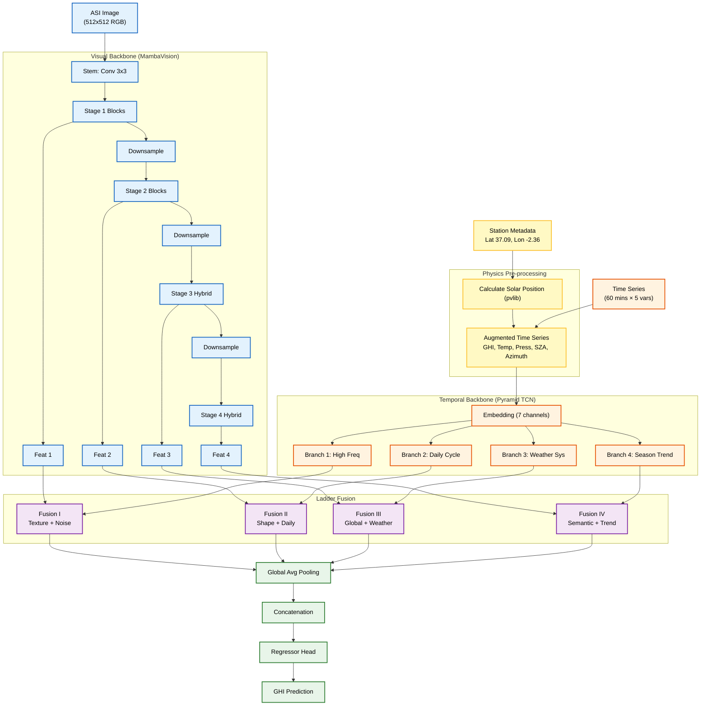

# SolarMamba: Physics-Informed Mamba-Ladder for Solar Nowcasting

## Overview
SolarMamba is a research-grade solar irradiance forecasting model that integrates:
1.  **Visual Backbone:** Nvidia MambaVision (Base) for extracting spatial features from All-Sky Imager (ASI) images.
2.  **Temporal Backbone:** Pyramid TCN for capturing multi-scale temporal patterns from weather station data.
3.  **Physics-Informed Logic:** Explicit integration of Solar Zenith Angle (SZA) and Azimuth, calculated via `pvlib`, to ground the model in physical reality.
4.  **Ladder Fusion:** A hierarchical fusion mechanism that combines visual and temporal features at multiple scales.

## Architecture



## Data Pipeline

### 1. Metadata Parsing
The system reads `PSA_timeSeries_Metas.csv` to extract station coordinates:
- **Latitude:** 37.0916
- **Longitude:** -2.3636
- **Altitude:** 490.587

### 2. Physics-Informed Feature Engineering
Using `pvlib`, we calculate:
- **Solar Zenith Angle (SZA)**
- **Solar Azimuth Angle**

These are appended to the raw weather data (GHI, DNI, DHI, Temp, Pressure) to form a 7-channel time series.

### 3. Night Filtering
Data points with **SZA > 85°** are strictly filtered out to prevent the model from learning trivial zeros during night time.

### 4. Image Matching
Images are matched to the nearest timestamp in the weather data. The system ensures a complete 60-minute history exists for each sample.

## Training

### Configuration
Edit `SolarMamba/config.yaml` to adjust parameters.

```yaml
training:
  epochs: 50
  learning_rate: 1.0e-4
  weight_decay: 1.0e-2
```

### Execution
Run the training script from the `SolarMamba` directory:

```bash
python train.py
```

### Loss Function
**MSE Loss** is used to minimize the error between predicted and actual GHI.

### Metrics
- **RMSE:** Root Mean Square Error ($W/m^2$)
- **nRMSE:** Normalized RMSE (%)
- **Skill Score:** Improvement over persistence baseline.

## Dependencies

- `torch`, `torchvision`
- `pandas`, `numpy`
- `pvlib` (Critical for solar geometry)
- `timm` (For MambaVision dependencies)
- `mamba_ssm` (For Mamba blocks)
- `PyYAML`
- `tqdm`
- `matplotlib`
- `einops`

## Quick Start

1. **Data Setup:**
   - Create `data/` directory in the project root (if not exists).
   - Place `PSA_timeSeries_Metas.csv` in `data/`.
   - Place ASI images in `data/images/`.
   - (Optional) Place pre-trained weights in `weights/`.

2. **Run Training:**

```bash
cd SolarMamba
./run.sh
```
