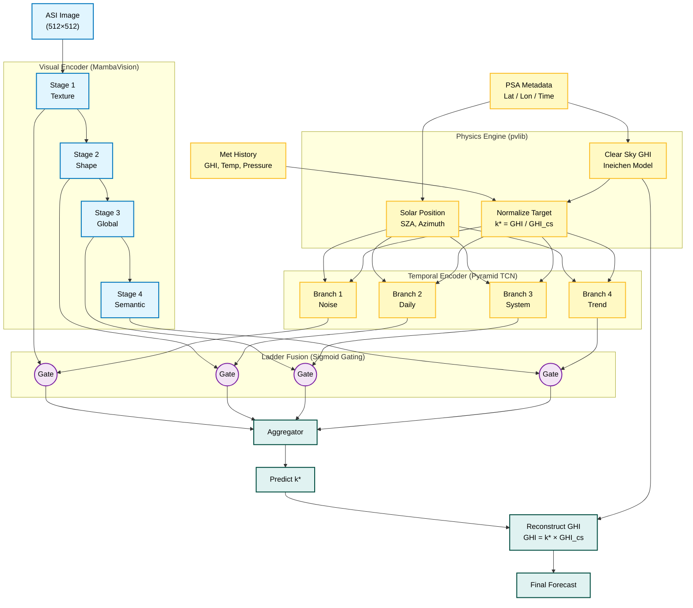
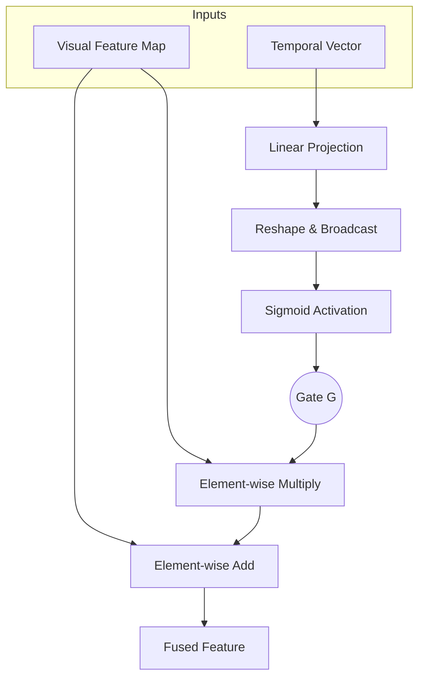

# SolarMamba Architecture

## Overview
SolarMamba is a hybrid physical-deep learning model designed for solar irradiance forecasting. It combines a visual encoder (MambaVision) with a temporal encoder (Pyramid TCN) using a gated fusion mechanism.

## Diagram



## Components

### 1. Visual Encoder
- **Backbone:** MambaVision-B
- **Features:** Extracted from Stages 1, 2, 3, and 4.

### 2. Temporal Encoder
- **Architecture:** Pyramid TCN
- **Branches:** 4 parallel branches with kernel sizes 3, 5, 7, 9.
- **Input:** 7 channels (k*, Temp, Pressure, SZA, Azimuth, sin_hour, cos_hour).

### 3. Ladder Fusion
- **Mechanism:** Residual Gating.
- **Logic:** The temporal vector is projected and passed through a sigmoid to create a gate. This gate modulates the visual features.
- **Formula:** $V_{out} = V_{in} \cdot \sigma(T_{proj}) + V_{in}$

### 4. Head
- **Structure:** Global Average Pooling -> Concatenation -> MLP -> Sigmoid -> Scale (1.2).
- **Output:** Clear Sky Index ($k^*$).

## Detailed Component Architectures

### 1. MambaVision Mixer Block
The core building block of the Visual Encoder. Unlike standard Transformers, it uses a State Space Model (SSM) for linear-time sequence modeling.

```mermaid
graph TD
    Input[Input Tensor] --> Norm[LayerNorm]
    Norm --> Linear_In[Linear Projection]
    Linear_In --> Split{Split}
    
    subgraph Main_Branch
        Split -- x --> Conv1_x[Conv1d]
        Conv1_x --> SiLU_x[SiLU]
        SiLU_x --> SSM[Selective Scan (SSM)]
    end
    
    subgraph Gating_Branch
        Split -- z --> Conv1_z[Conv1d]
        Conv1_z --> SiLU_z[SiLU]
    end
    
    SSM --> Concat[Concatenation]
    SiLU_z --> Concat
    Concat --> Linear_Out[Linear Projection]
    Linear_Out --> Output[Output Tensor]
```

### 2. Ladder Fusion Block
The mechanism for injecting physics-informed temporal context into the visual features. It uses a residual gating architecture.



### 3. Pyramid TCN (Temporal Encoder)
A multi-scale temporal encoder designed to capture weather patterns at different frequencies (noise, daily cycles, weather systems, trends).

```mermaid
graph TD
    Input[Weather Sequence] --> Embed[Linear Embedding]
    Embed --> Permute[Permute (B, C, T)]
    
    subgraph Parallel_Branches
        Permute --> B1[Conv1d k=3]
        Permute --> B2[Conv1d k=5]
        Permute --> B3[Conv1d k=7]
        Permute --> B4[Conv1d k=9]
        
        B1 --> R1[ReLU] --> P1[Global Avg Pool]
        B2 --> R2[ReLU] --> P2[Global Avg Pool]
        B3 --> R3[ReLU] --> P3[Global Avg Pool]
        B4 --> R4[ReLU] --> P4[Global Avg Pool]
    end
    
    P1 & P2 & P3 & P4 --> Output[List of 4 Vectors]

```
